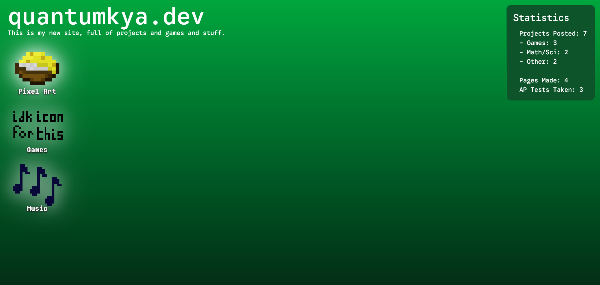
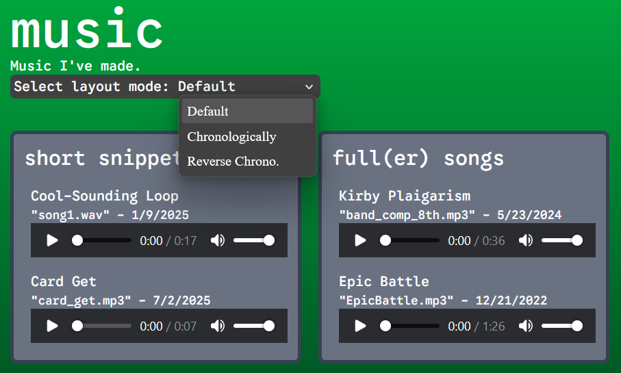
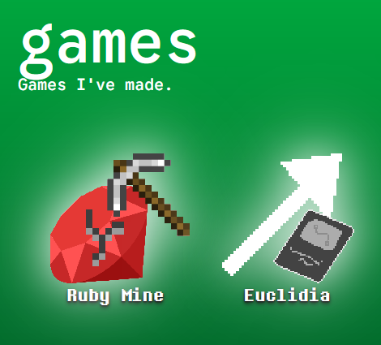
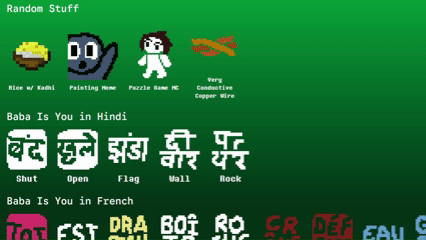

# Rohan's Page – quantumkya.dev

A page full of stuff I've made, like coding projects, music, and pixel art.

# pages

There's a page for everything I do:
- coding projects (homepage)
- making games
- making pixel art
- making music

## Home Page – /
Where the magic happens. Well, actually, most of the JS is on other pages, but whatever.

This is where you can get to other pages. Also, there's a statistics panel in the top-right that has some basic stuff about what I've done. I *might* remember to update that.

P.S. Have you ever wondered what's lurking in my homepage? Try delving deep into darker 
s of discovery with the power of the scroll wheel! I hope you'll find something interesting. Well, I hope you'll find it interesting.

## Music – /music
This is where I show off some music I've made! Currently, there are only five, but when I make more, I'll add them.

You can view my creations in different organizations, such as my own (Default), chronologically from old to new, or chronologically but from new to old!

## Games – /games
This is where the games I make go. They're pretty cool and maybe fun.

I know it's pretty barren, but I'll fix that by making more games!! That's fun for everyone.
...except for when I'm debugging...

## Pixel Art – /pixelart
This is where I put the pixel art that I've made (as long as I want to show it to people).

Some of them are gifs, too! Can you tell what one of my favorite games is? No, impossible!

One of them seems to be more excited than the others. lol. lmao even.
